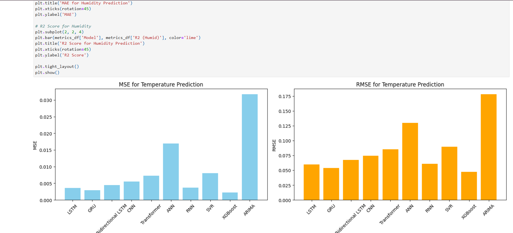

# Weather Prediction using Machine Learning Algorithms - Hillingdon Council UK



[Live Demo](https://zanjeel.github.io/Weather-Prediction-MachineLearningAlgorithms-HillingdonCouncilUK/MachineLearningModelsforWeatherPrediction.html)

## Overview
This project implements various machine learning algorithms to predict temperature and humidity based on historical weather data from Hillingdon Council, UK. The project compares different ML models to determine the most effective approach for weather prediction.

## Features
- Temperature and humidity prediction using multiple ML models
- Comparative analysis of different algorithms
- Interactive visualizations of predictions
- Performance metrics for each model
- Time series analysis and forecasting

## Tech Stack
- **Python** - Primary programming language
- **TensorFlow** - Deep learning framework
- **Scikit-learn** - Machine learning library
- **XGBoost** - Gradient boosting framework
- **Pandas** - Data manipulation and analysis
- **NumPy** - Numerical computing
- **Matplotlib** - Data visualization
- **Statsmodels** - Statistical modeling

## Machine Learning Models Implemented
1. LSTM (Long Short-Term Memory)
2. GRU (Gated Recurrent Unit)
3. Bidirectional LSTM
4. CNN (Convolutional Neural Network)
5. Transformer
6. SVR (Support Vector Regression)
7. XGBoost
8. ARIMA (AutoRegressive Integrated Moving Average)
9. ANN (Artificial Neural Network)
10. RNN (Recurrent Neural Network)

## Installation

1. Clone the repository:
```bash
git clone https://github.com/zanjeel/Weather-Prediction-MachineLearningAlgorithms-HillingdonCouncilUK.git
cd Weather-Prediction-MachineLearningAlgorithms-HillingdonCouncilUK
```

2. Create a virtual environment (recommended):
```bash
python -m venv venv
source venv/bin/activate  # On Windows: venv\Scripts\activate
```

3. Install dependencies:
```bash
pip install -r requirements.txt
```

## Dependencies
- tensorflow>=2.0.0
- numpy>=1.19.2
- pandas>=1.2.0
- scikit-learn>=0.24.0
- xgboost>=1.3.0
- matplotlib>=3.3.0
- statsmodels>=0.12.0
- psutil>=5.8.0

## Usage
1. Ensure your data is in CSV format with columns for date, time, temperature, and humidity
2. Run the Jupyter notebook:
```bash
jupyter notebook MachineLearningModelsforWeatherPrediction.ipynb
```

## Model Performance
- LSTM and GRU models show the best performance for both temperature and humidity prediction
- XGBoost performs exceptionally well for temperature prediction
- Traditional models like ARIMA show competitive performance for humidity prediction
- Detailed performance metrics and comparisons are available in the notebook

## Project Structure
```
├── MachineLearningModelsforWeatherPrediction.ipynb
├── MachineLearningModelsforWeatherPrediction.html
├── requirements.txt
├── temphumid data.csv
├── README.md
└── demo-photo.png
```

## Contributing
Contributions are welcome! Feel free to submit a Pull Request. For major changes, please open an issue first to discuss what you would like to change.

1. Fork the repository
2. Create your feature branch (`git checkout -b feature/AmazingFeature`)
3. Commit your changes (`git commit -m 'Add some AmazingFeature'`)
4. Push to the branch (`git push origin feature/AmazingFeature`)
5. Open a Pull Request

## License
This project is licensed under the MIT License - see the LICENSE file for details.

## Acknowledgments
- Hillingdon Council UK for providing the weather data
- Contributors and maintainers of the machine learning libraries used
- Open source community for their valuable resources 